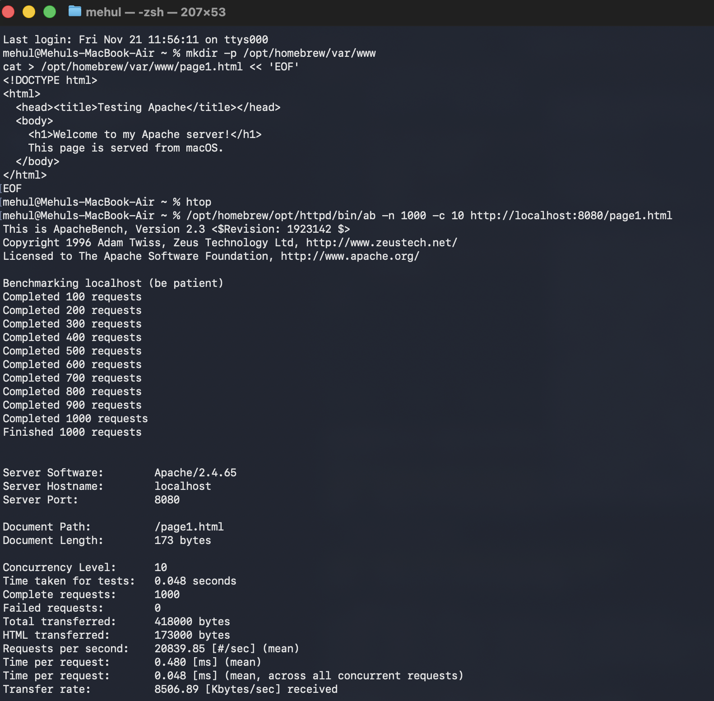
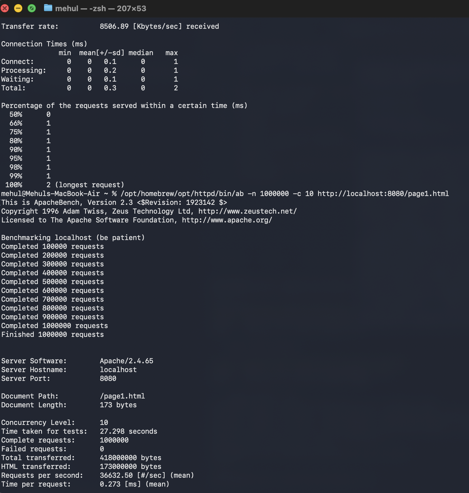
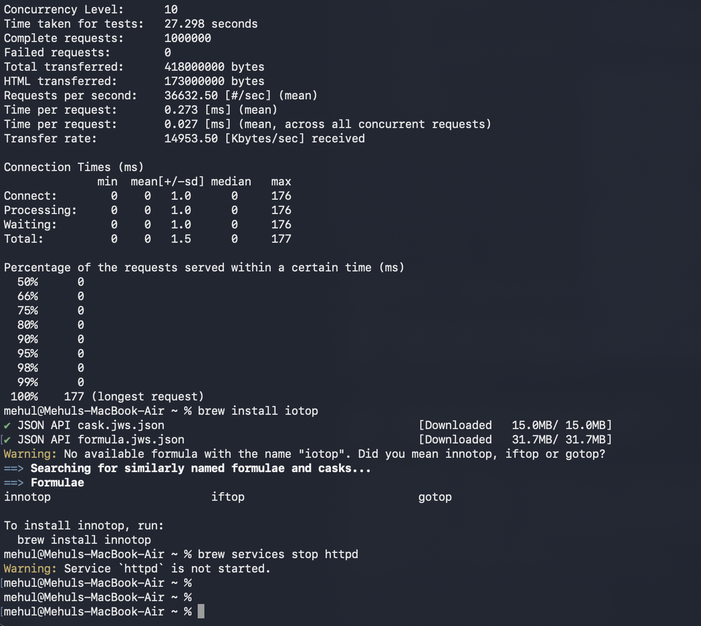

## Setting up the server 

Project: Performance Analysis of a Web Server
Objectives
By the end of this project, you should be able to:
1. Define and measure the latency and throughput of an information system.
2. Identify the bottlenecks (CPU, memory, I/O, network).
3. Use Linux monitoring tools ( top , htop , iostat ).
4. Interpret the results and propose performance improvements .
5. Relating the concepts of reliability and scalability to a concrete case.
Project context
A small business wants to verify if its internal web server can handle a surge in activity.
You are tasked with testing its performance , identifying limitations , and suggesting
optimization strategies .
Task to be completed:
### Step 1 – Server Setup
1. Start a Linux machine (preferably WSL Ubuntu)
2. Install a lightweight web server :
sudo apt install apache2
3. Place some HTML files in the server directory:
 - 3.1 — Locate the web server folder
By default, the Apache root directory (where the web pages are located) is:
/ var /www/ html
This is where the default home file is located:
/var/www/html/index.html
 - 3.2 Create or modify your HTML files
Create a file directly from the terminal
cd /var/www/html
sudo nano page1.html
Then add some simple content:
```
<!DOCTYPE html >
<html>
< head > < title >Testing Apache </ title > </ head >
<body>
<h1> Welcome to my Apache server ! </h1>
This page is served from WSL .
</body>
</html>
```
Save with Ctrl+O , then exit with Ctrl+X .
### Step 2 — Checking the Apache installation
• Granting the right rights:
sudo chmod 644 /var/www/html/*.html
sudo chown www- data:www -data /var/www/html/*.html
• Reload the Apache configuration
1. systemd units :
sudo systemctl daemon- reload
2. Restart Apache:
sudo service apache2 restart
3. Check that the service is running correctly:
sudo systemctl Apache2 status
You should see: active (running)
4. Next, test it in the browser:
Open: http://localhost
If everything is correct, the default page or your page1.html will be displayed .
### Step 3 – Charge Generation
From the same machine:
ab -n 1000 -c 10 http://localhost/page1.html
ab -n 1000000 -c 10 http://localhost/page1.html
During execution:
Monitor the system with ( in another instance of WSL Ubuntu):
• top
• htop
• iostat 2
sudo apt update
sudo apt install htop
sudo apt install sysstat
Note the CPU load, disk usage, and server behavior.
### Step 4 – Measurements and interpretation
1. Measure:
o Average response time (latency)
o Throughput (requests/s)
o CPU and I/O usage
2. Analyze:
o What is the bottleneck ? (CPU overloaded? Slow disk?)
o What would be a possible improvement ?
(caching, compression, connection limiting, adding a server…)
results ( Example):
Indicator Value Interpretation
Total number of
requests
1000 You have sent 1000 HTTP requests to Apache.
Simultaneous
requests
10 10 connections processed in parallel.
Total time 0.144 s Time required to execute the 1000 queries.
Requests per second 6956 req
/s
Very high throughput , because everything is local
(no real network).
Average time per
request
1.437 ms Very low latency , typical of a local test.
Failed requests 0 The server responded correctly to all requests.
Total size transferred 10.9 MB Total volume of data exchanged.



